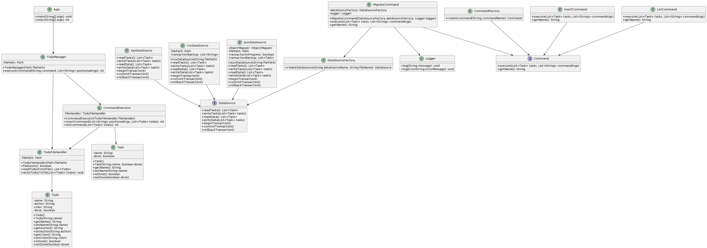

# L3 design pattern report

- **Firstname**: Elie
- **Lastname**: Jbeili

- **TP1**
> - J'ai apporté des améliorations au code en utilisant les principes SOLID. J'ai séparé chaque classe avec une seule responsabilité, respectant ainsi le principe de responsabilité unique (SRP). Le code est désormais ouvert à l'extension conformément au principe ouvert/fermé (OCP) grâce à l'introduction de classes spécifiques pour chaque type de fichier. De plus, j'ai veillé à ce que les sous-classes suivent le contrat de l'interface FileHandler, respectant ainsi le principe de substitution de Liskov (LSP). J'ai également inversé les dépendances en utilisant l'interface FileAccess, conformément au principe d'inversion des dépendances (DIP). Enfin, j'ai respecté le principe de ségrégation des interfaces (ISP) en concevant des interfaces spécifiques aux besoins de chaque classe. Ces modifications ont rendu le code plus modulaire, extensible et conforme aux principes SOLID

> 

> - Deux ressources clés m'ont aidé dans mon apprentissage : YouTube et ChatGPT. YouTube a été précieux pour sa diversité de tutoriels qui m'ont permis de mieux comprendre les principes grâce à des explications visuelles. De plus, ChatGPT a joué un rôle crucial en me fournissant des exemples concrets en Java et en corrigeant mes erreurs, ce qui a été particulièrement utile car je n'avais pas utilisé Java depuis un certain temps. Ensemble, ces deux outils ont renforcé ma compréhension et mes compétences.

>  
 
> - Ce qui m'a posé le plus de difficultés était d'avoir oublié les concepts de la programmation orientée objet (OOP) en Java. Cela a rendu la compréhension des principes SOLID plus complexe, car ils sont étroitement liés aux concepts OOP. Cependant, avec de la persévérance et de l'apprentissage supplémentaire, j'ai finalement réussi à les maîtriser. Je vais continuer à faire de mon mieux pour me souvenir de tout et renforcer mes connaissances.

>
 
> 

>
- **TP2**

>- J'ai récemment amélioré notre application de gestion de tâches en y ajoutant une fonctionnalité clé. Tout d'abord, j'ai intégré l'option --done dans le système de gestion des arguments de ligne de commande. Cette modification permet désormais de marquer les tâches comme étant accomplies dès leur ajout. Ensuite, j'ai ajusté l'interface FileHandler, modifiant la méthode insert pour qu'elle accepte un paramètre booléen isDone. Cette modification est essentielle pour suivre l'état des tâches.

>- Pour les gestionnaires de fichiers spécifiques, JsonFileHandler et CsvFileHandler, j'ai procédé à des mises à jour significatives. Dans JsonFileHandler, j'ai adapté les méthodes insert et list pour traiter et afficher l'état done des tâches, les stockant comme des objets JSON avec les champs todo et done. De même, dans CsvFileHandler, j'ai ajusté ces méthodes pour prendre en charge l'état done, enregistrant les tâches dans un format CSV simple.

>- Enfin, j'ai remanié la méthode exec dans la classe App pour gérer correctement l'option --done, en passant les arguments nécessaires au FileHandler. Grâce à ces améliorations, notre application est désormais capable d'ajouter des tâches avec un statut done et de filtrer les tâches affichées en fonction de leur état d'achèvement. Ces modifications renforcent considérablement la fonctionnalité et la flexibilité de notre application.

>
- **TP2**
  >
>-J'ai d'abord séparé chaque classe dans des fichiers distincts, suivant la convention Java recommandant un seul fichier par classe. Ensuite, j'ai révisé chaque classe pour garantir qu'elle respecte le principe de responsabilité unique (SRP), en se concentrant sur une seule tâche. Pour réduire le couplage entre les couches de l'application, j'ai réorganisé le code pour que la couche de présentation n'ait pas d'impact direct sur les couches de service ou de stockage. En introduisant une abstraction de service plus flexible avec `FileHandler`, j'ai permis d'ajouter de nouvelles fonctionnalités sans modifier le code existant. Enfin, j'ai amélioré la représentation des todos en introduisant une classe `Todo`, ce qui rend le code plus modulaire, extensible et conforme aux bonnes pratiques de conception logicielle.

- **TP3**

>1. **Command Pattern**:
 > - **Description**: Encapsulates migration logic as a command object, promoting decoupling and reusability.
  >- **Impact**: Enables dynamic invocation of migration operations without tight coupling, facilitating extensibility and maintainability.

>2. **Factory Method Pattern**:
>  - **Description**: Utilizes `DataSourceFactory` to create data source instances, promoting loose coupling and scalability.
 > - **Impact**: Enhances maintainability by abstracting data source instantiation, allowing easy addition or modification of data sources.

>3. **Transaction Management**:
 > - **Description**: Handles transaction management for data integrity during migration.
 > - **Impact**: Ensures consistency and reliability by wrapping migration process in transactions, with rollback capability in case of failures.

>4. **Dependency Injection**:
 > - **Description**: Employs dependency injection for `DataSourceFactory` and `Logger`, promoting flexibility and testability.
  >- **Impact**: Facilitates unit testing and adherence to Dependency Inversion Principle (DIP) by decoupling `MigrateCommand` from concrete dependencies.

>I find the course challenging, and it's difficult for me, despite dedicating hours of work. Unfortunately, I'm still struggling to produce high-quality code.
> 
> 
>-